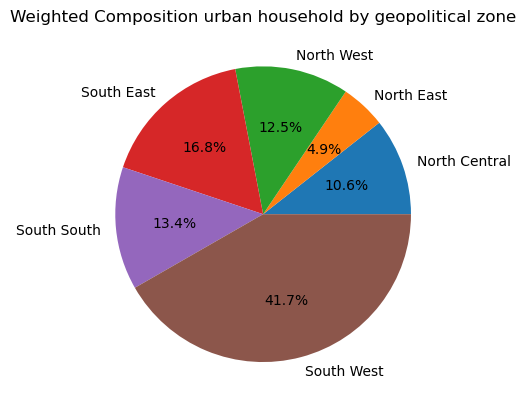
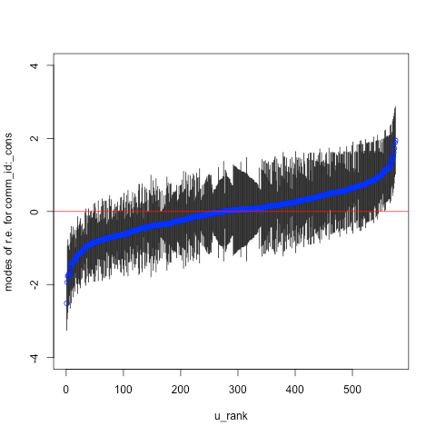

# Determinants of Household Food Insecurity Amongst Urban Household in Nigeria
A multilvel multinorminal logistic regression and mixed effect analysis to assess factors associated with household food insecurity in Urban Nigeria.

**Multilevel models (MLMs)** are frequently used in social and health sciences where data are typically hierarchical in nature. However, the commonly used hierarchical linear models (HLMs) are appropriate only when the outcome of interest is normally distributed. When you are dealing with outcomes that are not normally distributed (binary, categorical, ordinal), a transformation and an appropriate error distribution for the response variable needs to be incorporated into the model. Therefore, hierarchical generalized linear models (HGLMs) need to be used.

We are interested in modelling the food security status (moderate or severe, severe, secure-moderate-severe levels) of individual urban housholds (level-1) nested within clusters(level-2). In the dichotomous case (moderate or/and severe). The primary interest of the current study is to investigate the impact of certain individual- and household-level variables on a household likelihood of being moderate or/and severely food insure.

The models fitted include;
* Null model: Model containing no predictors
* Model I: Model containing only individual/household-level predictors
* Model II: Model containing only community-level predictors
* Model III: Model containing both individual-houshold and community-level predictors.

<!-- The general equation of the random intercepts two-level multinomial logistic regression
model used for analysis of predictors of FI takes the form. -->

### Research Questions for Binary (Dichotomous outcome)
1. What is the food insecurity status for household in Nigeria.
2. Do food insecurity status vary across community level (clusters)?
3. What is the relationship between individual/household characteristic and the likelihood of being moderately or/and severely FI while controlling for individual/household and community characteristics?
4. What is the relationship between community level(cluster) and the likelihood of being moderately or/and severely FI while controlling indidual/houshold and community characteristics?


### Research Questions for Polytomous outcome

1. What is the likelihood of being moderate(FI=2) or severe(FI=3) for household in Nigeria
2. Does the likelihood of being being moderate(FI=2) or severe(FI=3) vary across communities(clusters).
3. What is the relationship between individual/household characteristics and the likelihood of being moderately or severely FI.
4. What is the relationship between community level characteristic and the likelihood of households being moderately or/and severely FI.


## Data
This study is based on quantitative cross-sectional data derived from the Nigeria 2021 Multiple Indicator Cluster Survey (MICS6), which is a nationally representative survey that collects sociodemographic and health indicators from both household, males and females aged 15–49 years.

The survey utilized a multistage stratified cluster sampling approach that employed a probability proportional to size to select enumeration areas in the first stage based on the 2006 Population and Housing Census of the Federal Republic of Nigeria (NPHC). In the second stage, 20 households were randomly selected within each enumeration area.

The downloaded data from [[4]](https://mics.unicef.org/surveys) include survey data from **MICS** or NICS. For this project we shall use the MICS only.

<center>

<figcaption style="font-size: 10px; font-style: italic;">Fig. 1: Weighted composition of urban househld by geopolitical zone in the dataset</figcaption>
</center>

## Data Processing/Cleaning
* The original household dateset(`hh`) comprises of 41532 dataset.
* nested within 1,850 clusters
* The dataset contains data from two seperate surveys (MICS and NCIS). We filter by **MICS** survey, **URBAN** area and household who provided consent only.
* Women(wm), men(mn), and children(ch) data is merged with the household(hh) dataset.
* After data preprocessing, we proceed with modeling with only 10680 records and 36 variables.


        
## Predictors/Explanatory Variables
The explanatory variables used in the analysis were selected based on a comprehensive review
of the literature, their biological plausibility in the exposure-outcome relationship, and their
availability in the survey data studied.
* Wealth index
* Zone (eg South South, South East...)
* Household size
* Household head gender, age, education
* Household own dwelling
* Household ownership of agricultural land and livestock
* Number of women
* Number of men
* Number of children under 5 year
* Number of children between 5-15 years
* Household women who attended school (hh_wm_attended_sch_num)
* Household women average age (hh_wm_mean_age_yrs)
* Number of women who attended at least secondary school
* Household women mean life satisfaction (hh_wm_mean_life_satisfaction)
* Household men who attended school (hh_mn_attended_sch_num)
* Number of men who attended at least secondary school
* Household men mean life satisfaction (hh_mn_mean_life_satisfaction)


## Dependent Variables (FIES)
The outcome of this study was food insecurity. The MICS measures
household FI using the standardized eight-item Food Insecurity Experience Scale (FIES). The
FIES was developed by the United Nations Food and Agriculture Organization (UN FAO)[[1]](https://openknowledge.fao.org/items/e26bf231-39f4-423d-b3a9-49e0f5d9aef9) to
provide internationally comparable estimates of the magnitude of FI experience in accordance
with the Sustainable Development Goal (SDG) indicator 2.1.2 - “prevalence of moderate or
severe FI in the population, based on the Food Insecurity Experience Scale (FIES)” 

Raw house-hold FI scores (0–8) were computed as the total number of affirmative responses, and partici-
pants were categorized into three levels of FI based on their scores. Scores ranging from 0 to 3 indicate food secure, scores ranging from 4 to 6 indicate moderate FI, and scores ranging from
7 to 8 indicate severe FI based on previous literature [[2]](https://pubmed.ncbi.nlm.nih.gov/33937614/)


### FIES analysis methodology

This involves applying the Rasch Model to the FIES response data and assessing whether the data
conform to the model’s assumptions. If the data do conform to the assumptions, we can conclude
that the data can be used to calculate a valid measure of food insecurity.

**What are the model assumptions?**

The Rasch model is based upon four key assumptions:

1. Only one dimension is represented by the response data. For the FIES, this is the access dimension
of food security.
2. An individual’s responses to the eight FIES items are correlated with each other only because they are all
conditioned by the severity of food insecurity of that individual.
3. The greater the severity of food insecurity experienced by a respondent, the higher the likelihood
that he or she will respond affirmatively to each item.
4. All items are equally strongly related to the latent trait of food insecurity and differ only in severity.


#### Results from Rasch Model Analysis
The prevalence FI among urban household in Nigeria was high as determined by the Rasch model (at 75% mean reliance), with nearly 67% of the respondents reporting moderate to severe FI in the past 12 months (95% CI = 66.3%-70.8%) with 41.5 % at severe level of FI in 2021.


## Modelling
Several weighted **multilevel** multinomial logistic regression models were fitted to
assess the association between individual-/household-s level and community-level charac-
teristics with FI. We estimated and reported both fixed effects and random effects to mea-
sure the associations and variations, respectively.


We will begin by fitting a null or empty two-level model, that is a model with only
an intercept and community(cluster) reffects. 


$$\log\left(\frac{\pi_{ij}}{1 - \pi_{ij}}\right) = \beta_j +  u_{oj}$$


The intercept $\beta_0$ is shared by all communities(clusters) while the random effect $u_{oj}$ is
specific to community $j$. The random effect is assumed to follow a normal
distribution with variance $\sigma^2_{u0}$


From the model estimates (using Laplacian approximation and Adaptive Gauss-Hermite Quadrature), we see that the log-odds of a household being Moderate or Severely FI in an 'average' cluster (one with $u_{0j}$ = 0) is estimated as $\hat{\beta}_{0}$ = 0.99681. The intercept for cluster $j$ is 0.99681 + $u{0j}$, where the variance of $u{0j}$ is estimated as $\sigma^2_{u0}$ = 0.6272.

```R
%%R
fita <- glm(MSI ~ 1, data = data, weights =hhweightmics,  family = binomial("logit"))

logLik(fita)-logLik(fit)
> 'log Lik.' -398.9647 (df=1)
```
The test statistic is 797.9294 (-2*(-398.9647)) with 1 degree of freedom, so there is
strong evidence that the between-community variance is non-zero.


The likelihood ratio statistic for testing null hypothesis that $\sigma^2_{u0}$ = 0, can be calculated by comparing the two-level mode, with the corresponding single-level model without the level 2 random effects.
<center>

<figcaption style="font-size: 10px; font-style: italic;">Estimated residuals for all 575 communities (clusters) in the sample (urban area)</figcaption>
</center>


The plot shows the estimated residuals for all 575 communities (clusters) in the sample (urban area). For a substantial number of communities, the 95% confidence interval does not overlap the horizontal line at zero, indicating that Moderate or Severe FI in these communities is significantly above average (above the zero line) or below average (below the zero line).

### Model Building Strategy
>Our data comprises of J clusters, with a different number of household $n_j$ in each cluster. On
the houshold level, we have the outcome variable 'Food Insecurity' (**Y**), measured by a scale
that ranges from 0 to 8. We have 8 explanatory variables (**X**) on
the houshold level: as identified above and two cluster level explanatory variables `zone` (6 geopolitical area) and cluster(community) level wealth index or poverty computed by aggregating the wealth index score within cluster.


<!-- Multivariate analysis revealed that higher parity, households with 5 or more members, household wealth index,
urban residence, and community-level poverty were significantly associated with FI. Our
study demonstrates a significantly high prevalence of FI among pregnant women in Nigeria
in 2021. Given the negative consequences of FI on maternal and child health, implementing
interventions to address FI during pregnancy remains critical to improving pregnancy
outcomes. -->


## References
1. [FAO. 2016. Methods for estimating comparable rates of food insecurity experienced by adults throughout the world. Rome, FAO](https://openknowledge.fao.org/items/e26bf231-39f4-423d-b3a9-49e0f5d9aef9)
2. [Sheikomar OB, Dean W, Ghattas H, Sahyoun NR. Validity of the FI Experience Scale (FIES) for Use in
League of Arab States (LAS) and Characteristics of Food Insecure Individuals by the Human Develop-
ment Index (HDI). Curr Dev Nutr. 2021; 5(4):nzab017.](https://pubmed.ncbi.nlm.nih.gov/33937614/)
3. [Ujah OI, Olaore P, Ogbu CE, Okopi J-A, Kirby RS (2023) Prevalence and determinants of
food insecurity among pregnant women in Nigeria: A multilevel mixed effects analysis. PLOS Glob
Public Health 3(10): e00023](https://doi.org/10.1371/journal.pgph.0002363)
4. [United Nations Children's Fund (UNICEF). Nigeria - Multiple Indicator Cluster Survey 2021, Round 6 (MICS 2021). Ref: NGA_2021_MICS_v01_M. Downloaded from https://mics.unicef.org/surveys on 09 July, 2024](https://mics.unicef.org/surveys)

