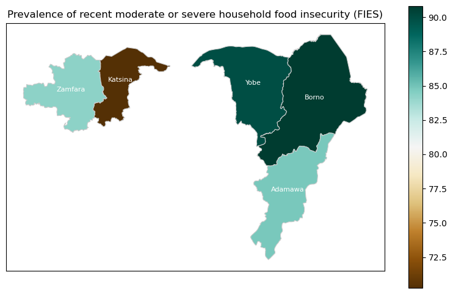
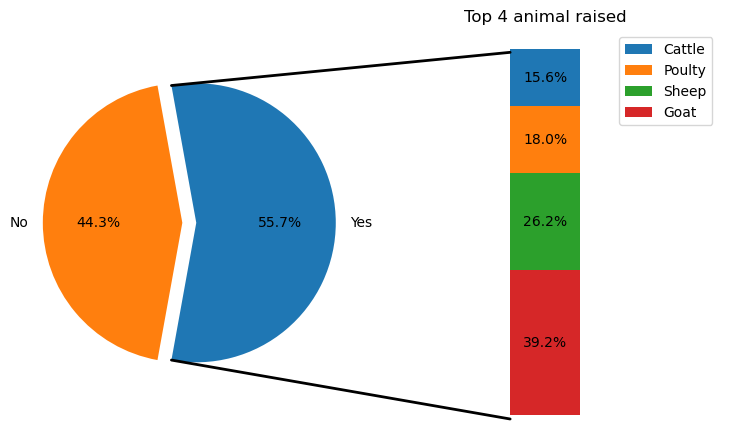
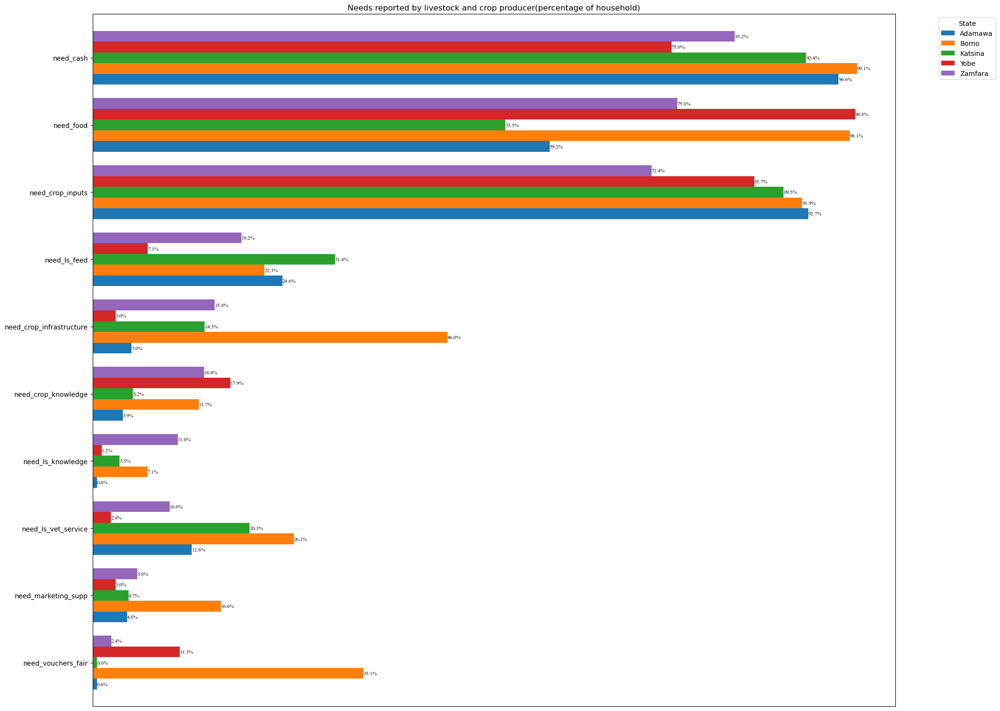
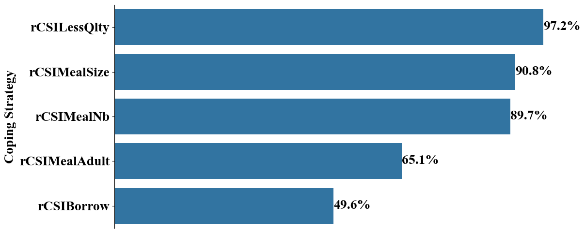

# Food Security: Determinants of Household Food Insecurity

Social Determinants of the prevalence of moderate or severe household food insecurity in 5 states in Northern Nigeria, based on the Food
Insecurity Experience Scale (FIES)

  

## Dataset

The dataset for this project is the round 6 survey face-to-face interviews conducted from 21 January to 5 February 2024, reaching 3441 households in different 5 states, using the Food Insecurity Experience Scale survey module (FIES-SM) developed by FAO. Data collection took place at the beginning of the lean season across five states: Adamawa, Borno, Katsina, Yobe and Zamfara. Data were weighted using population counts. The can data can be requested can be requested for at [FAO Data in Emergencies Hub](https://data-in-emergencies.fao.org) (CC BY-NC-SA 3.0 License). 

The DIEM-Monitoring system was established under the Food and Agriculture Organization (FAO) of the United Nations. The main purpose of the DIEM-Monitoring system is to collect data from households and key informants in countries prone to multiple shocks.

## FIES Questions
The current FIES-SM module include eight questions as in the table below.

| Questions                     | Severity of Food Insecurity                         |Label           |
|-------------------------------|-----------------------------------------------------|----------------|
| **Q1.** During the last 30 days, was there a time when you or others in your household were worried about not having enough food to eat because of lack of money or other resources?| Mild| Worried|
| **Q2.** During the last 30 days, was there a time when you or others in your household were unable to eat healthy and nutritious food because of lack of money or other resources?| Mild |Healthy|
| **Q3.** During the last 30 days, was there a time when you or others in your household ate only a few kinds of foods because of lack of money or other resources? | Mild|FewFoods|
| **Q4.** During the last 30 days, was there a time when you or others in your household had to skip a meal because of lack of money or other resources to get food? | Moderate |Skipped|
| **Q5.** During the last 30 days, was there a time when you or others in your household ate less than you thought you should because of lack of money or other resources?| Moderate |Ateless|
| **Q6.** In the past 30 days, was there ever no food to eat of any kind in your house because of lack of resources to get food? | Moderate |Ranout|
| **Q7.** In the past 30 days, did you or any household member ever go to sleep at night hungry because there was not enough food? | Severe |Hungry|
| **Q8.** In the past 30 days, did you or any household member ever go a whole day and night without eating anything at all because there was not enough food?| Severe |Whlday|

## Objectives
The main objective of this project is:

> **To investigate the social determinants of severe household food insecurity in 5 northern states in Nigeria.**

### Specific Objectives
1. Assess the validity of FIES for use in Nigeria with Rasch Model
2. Determine the prevalence of food insurity (FI) by state.
3. Examine the association between sociodemographic and economic characteristics of individuals and Severe FI.

To achieve this objective, it was further broken down into the following 5 technical sub-objectives:

0. Perform data cleaning
1. Perform quality assurance through testing of adherence to `Rasch` model assumptions. 
2. To perform in-depth exploratory data analysis of the datasets.
3. To engineer new predictive features from the available datasets.
4. To develop a statistical model(s) to model the association between household and severe food insecurity.

## Rasch Model Insights
* From the quality assurance analysis with Rasch Model to verify the validity and reliability of the FIES data, we found the following:
    - The weighted **infit** statistics for the FIES data in our study were within the acceptable range of [0.7–1.2], which verified that the FIES data is a reliable and valid measure to assess food insecurity in this population.
    - Mean Rasch Model `reliability` was 0.752. These levels of reliability for a scale comprising just eight items reflect reasonably good model fit.

### EDA
From the exploratory data analysis, we found out the following:
* Unable to eat healthy and nutritious food because of lack of money and other resources (HEALTHY) is the most experienced by the sampled household (91%).
* According to the FIES, 82 percent of the households were affected by recent food insecurity (RFI) at **moderate or severe level**, and 18.9 percent were affected by severe RFI.
    - Borno presents the highest percentage of households affected by RFI at moderate or severe level.
    - Katsina presents the lowest percentage of households affected by RFI at severe level.
    - The level of FIES moderate or severe, and severe were higher for female-headed households compared to male-headed households and this difference is statistically significant (kruskal-wallis)
* **Education**: Religious education was the most reported level of education across the household.
    - The level of FIES moderate or severe, and severe were lower for higher educated households compared to No education households.
* **Agriculturl Activities**: 48.3% the households participated in both crop and livestock production. While 44.0% and 4.6% participated in crop and livestock only production respectively.
    - The highest percentage of houshold participating in crop production only is in Yobe with 61.9%.
    - Adamawa record the highest number of household engaged in both crop and livestock production (61.1%)
* **Income**: The analysis reveals a decrease in the main source of income was reported by 46.9 percent of the households in the three months preceding the survey, compared to the same period in a typical year.
    - Respondents who report more than one income source, experience increased income (38.7%) compared to respondents with one income source (26.4%).
    - Respondents who report more than one income source, experience more decrease in their income (54.7%) compared to respondents with one income source (41..%).
    - The main sourse of income is income from agricultural activities (73.5%).
* **Shocks**: Ninety-nine percent of the surveyed households reported having faced at least one shock in the three months preceding the interview.
    - The main reported shocks were unusually high food prices (81 percent). Followed by unusually high fuel or transport prices (72 percent)
    - Zamfara reported the highest shock from violence and conflicts (53.2 percent) followed by Borno state (29.0 percent). Yobe experienced the least shock from violence and conflicts as less than 1 percent.
    - Shock from drought is highest in Borno (37 percent) followed by Yobe (14 percent). No shock from drought was reported in Adamawa.
    - The shock from plant disease affected crop producing HHs the most while on the other hand, livestock producers was affected by animal disease the most. Irrespective of the household agricultural activity, all surveyed respondents experiences high shock from higher food prices and fuel prices.
* **Major Crop**: The result of the major crop produced shows that 35 percent of the respondent who are identified as crop producers report `No Crop Production` in the past three months. This is an interesting find. Can we determine when they didn't produce?
* **Cultivated Crop Area**: Pronounced changes in crop area, with a reduction in cultivated area (64 percent) were reported in Zamfara, in particular , while Borno, on the other hand, presented an increase in cultivated area (58%)
compared to the same period in a typical year.
* **Harvested Area**: Pronounced changes in harvest area, with a reduction in harvested area (84 percent) were reported in Yobe,in particular , while Adamawa, on the other hand, presented an increase in cultivated area (51 percent)
compared to the same period in a typical year.
    - An increase in the main source of income was reported by 70% percent of the households who reported increase crop harvested area in the three months preceding the survey.
    - Increase or decrease in harvest area is associated with increase or decrease in main income. **Is this relationship significant?** Yes
* **Crop Production Difficulty**: Crop production difficulties were reported by 75 percent of the crop producers.
    - These included access to fertilizer (81 percent) – especially in Katsina (96 percent), Borno (84 percent) and Zamfara (71 percent)
    - Householf that reported crop production difficulties experience higher decrease in their crop harvested area compared to those who didn't experience difficulty. Is the relationship significant?
    - Households who reported crop production difficulty reported a decrease in main income. And the association is significant at 0.05 p value.
    - There is slight proportion of household that experience decrease in harvested area as a result of difficulty accessing fertilizer. And the difference is statistically siginicant. 
* **Livestock Production Difficulties**: About 56 percent of the households surveyed were livestock producers.
    - Among them, 78 percent experienced livestock production difficulties.
    - The main livestock production difficulties experienced were difficulties purchasing feed (67 percent) – mostly reported in Yobe (94 percent), Katsina (64 percent) and Zamfara (56 percent).
    - Goat and sheep are the most raised animals at 39.2 and 26.2 percent respectivitely

  

* **Needs**: About 98.5 percent of the surveyed households reported the need for assistance, but only 9 percent reported having received some form of assistance.
    - Despite food and cash being requested across all states, some requested specific support. In Adamawa, respondents identified the need for livestock feed;
    - In Borno, respondents requested crop infrastructure, voucher fairs, veterinary services and veterinary feed;

  

* **Coping Strategy**: The coping strategy analysis reveals that relying on less quality food is more used strategy again food insecurity. Followed by reduction the size of meal.

  

## Modelling

[Binary logistic regression](https://www.statisticssolutions.com/binary-logistic-regression/) model was used to determine the relationship between the dependent variables and a set of independent variables

First a univariate logit fit was performed. All significant independent variables is then use to fit a multivariate logit analysis.

### Variable Selection
#### Dependent Variable
Household(HH) Food Insecurity Experience Scale (FIES).
To predict the prevalence of food insecurity, the outcome variable food security `fies_rawscore` is categorized as a binary variable (food secure and food insecure) based on the suggested thresholds according to [FAO](https://www.fao.org/3/bp091e/bp091e.pdf):

* Moderate Severe Food Insecurity (`fies`) = 0 (if food insecurity experience scale (`fiesrawscore`) ≤ 6)
* Severe Food Insecurity (`fies`) = 1 (if `fiesrawscore` > 6)

## Independent Variables

* State (`state`)
* Household size (`hh_size`)
* Cultivated Land size (`crp_landsize_ha`)
* Household Agricultural Activities (`hh_agricactivity`)
* HH Gender (`hh_gender`)
* HH Education (`hh_education`)
* Source of main Income (`income_main_cat`)
* Gender who contral main income (`income_main_control`)
* Maritial status of HH (`hh_maritalstat_clean`)
* Climatic, economic and social shocks (shock_higherfoodprices, shock_drought, shock_flood, shock_plantdisease, shock_animaldisease, shock_violenceinsecconf)

## Authors

* [Adeyemi Biola](https://github.com/decorouz)
