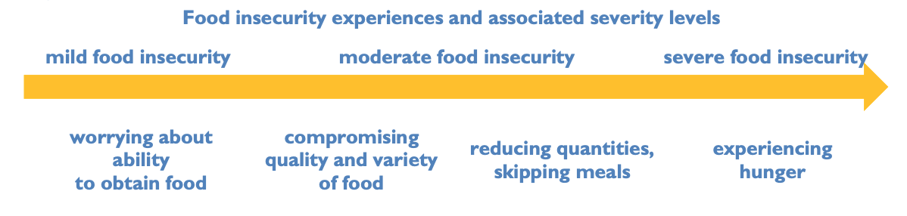

# Food Security: Determinants of Household Food Insecurity

Determinants of the prevalence of moderate or severe household food insecurity in 5 states in Northern Nigeria, based on the Food
Insecurity Experience Scale (FIES)

## Dataset

The dataset for this project is the round 6 survey of 3441 households from 5 states, collected between January and February 2024 using the Food Insecurity Experience Scale survey module (FIES-SM) developed by
FAO. The can data can be requested can be requested for at [FAO Data in Emergencies Hub](https://data-in-emergencies.fao.org) (CC BY-NC-SA 3.0 License). 

The DIEM-Monitoring system was established under the Food and Agriculture Organization (FAO) of the United Nations. The main purpose of the DIEM-Monitoring system is to collect data from households and key informants in countries prone to multiple shocks.

## FIES Questions
The current FIES-SM module include eight questions as in the table below.

| Questions                     | Severity of Food Insecurity                         |Label           |
|-------------------------------|-----------------------------------------------------|----------------|
| **Q1.** During the last 30 days, was there a time when you or others in your household were worried about not having enough food to eat because of lack of money or other resources?| Mild| Worried|
| **Q2.** During the last 30 days, was there a time when you or others in your household were unable to eat healthy and nutritious food because of lack of money or other resources?| Mild |Healthy|
| **Q3.** During the last 30 days, was there a time when you or others in your household ate only a few kinds of foods because of lack of money or other resources? | Mild|FewFoods|
| **Q4.** During the last 30 days, was there a time when you or others in your household had to skip a meal because of lack of money or other resources to get food? | Moderate |Skipped|
| **Q5.** During the last 30 days, was there a time when you or others in your household ate less than you thought you should because of lack of money or other resources?| Moderate |Ateless|
| **Q6.** In the past 30 days, was there ever no food to eat of any kind in your house because of lack of resources to get food? | Moderate |Ranout|
| **Q7.** In the past 30 days, did you or any household member ever go to sleep at night hungry because there was not enough food? | Severe |Hungry|
| **Q8.** In the past 30 days, did you or any household member ever go a whole day and night without eating anything at all because there was not enough food?| Severe |Whlday|

## Objectives

The main objective of this project is:

> **To investigate some of the determinants of severe household food insecurity in 5 northern states in Nigeria.**

## Main Insights
### Quality Assurance
From the quality assurance analysis with Rasch Model to verify the validity and reliability of the FIES data, we found the following:

* The weighted **infit** statistics for the FIES data in our study were within the acceptable range of [0.7–1.2], which verified that the FIES data is a reliable and valid measure to assess food insecurity in this population.
* Mean Rasch Model `reliability` was 0.752. These levels of reliability for a scale comprising just eight items reflect reasonably good model fit.

## Authors

* [Adeyemi Biola](https://github.com/decorouz)
