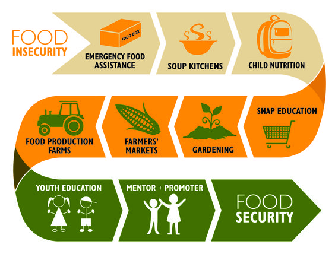

# Food Insecurity: Determinants of Household Food Insecurity

Billions of people suffer from food insecurity. What does it mean to be food insecure? In this repository, we explore the determinants of houshold and individual Food Insecurity in Nigeria.

> Food insecurity is defined by the Food and Agriculture Organization (FAO) of the United Nations as the “situation when people lack secure access to sufficient amounts of safe and nutritious food for normal growth and development and an active and healthy life.”


# Overview

These project aim to analyze various food insecurity indicators, such as the Household Dietary Diversity Score (HDDS), the Food Insecurity Experience Scale (FIES), and the Minimum Dietary Diversity Score for Children and women (MDDS). By leveraging data science techniques and Python/R libraries, these projects will provide insights into food insecurity patterns in urban and rural households in Nigeria.


## Source Data

1. Food and Agriculture Organization of the United Nations (2023) – with major processing by Our World in Data. https://data-in-emergencies.fao.org/pages/monitoring
2. Multiple Indicator Cluster Survey (2021). Available from https://mics.unicef.org/surveys


## Tools and Technologies
* Python: Primary programming language for data analysis.
* R: Primary programming language thesis descriptive statistics
* StatsModel: Primary programming language thesis descriptive statistics
* Pandas: For data manipulation and analysis.
* NumPy: For numerical computations.
* Matplotlib/Seaborn: For data visualization.
* Scikit-learn: For statistical analysis and machine learning.
* Jupyter Notebook: For interactive coding and visualization.


# Project structure


```bash
├── data
│   ├── DIEM_NG/
│   │   ├── raw/
|   |   ├── processed/
│   ├── misc6ng
│   │   ├── raw/
|   |   ├── processed/
├── FIES/
├── HDDS/
├── MDDS/
├── utils/
├── LICENSE
├── README.md
└── .gitignore
```


# Keywords
Zero Hunger, Data Collection, Data Analysis, Statistical Inferences, Rasch Model, FIES, Food Insecurity

# Acknowledgments/References
> * Hannah Ritchie (2023) - “How is food insecurity measured?” Published online at OurWorldInData.org. Retrieved from: 'https://ourworldindata.org/food-insecurity' [Online Resource]
> * SDG Indicator 2.1.2 – Using the Food Insecurity Experience Scale (FIES) - “Statistical validation of FIES
data” Published online at OurWorldInData.org. Retrieved from: [Online Resource](https://elearning.fao.org/pluginfile.php/491591/mod_scorm/content/5/story_content/external_files/SDG2.1.2_lesson3.pdf)
> * Nord, M. 2014. Introduction to Item Response Theory applied to Food Security Measurement:
Basic Concepts, Parameters, and Statistics. Technical Paper, FAO, Rome.
(available at http://www.fao.org/economic/ess/ess-fs/voices/en)  

# License
Specify the license under which your code is released. Moreover, provide the licenses associated with the dataset you are using. This is important for others to know if they want to use or contribute to your project. 

For this github repository, the License used is [MIT License](https://opensource.org/license/mit/).

# Contact
For any questions or suggestions, please open an issue on GitHub or contact me at [abiola2326@gmail.com].